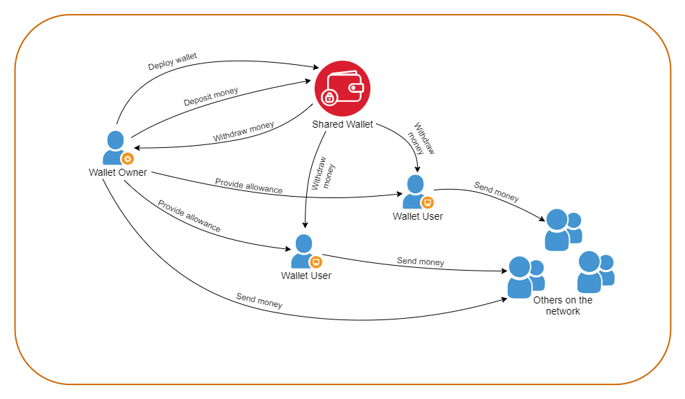

# Shared Wallet
#### A smart contract deployed on Goerli Test Network

---

## Contract details

* The **Owner** can:
  * deposit money into the wallet
  * withdraw any amount of money from the wallet
  * send money to _any_ account on the network from the wallet, **including self**
  * set allowances for the other users of the wallet

* A **user** can:
  * withdraw money from the wallet, which is _limited by the allowance set for that user by the owner of the wallet_
  * send money to _any_ account on the network from the wallet, **including self**

---

## Web Interface details

### Requirements

1. Metamask extension for the web browser
2. An account on Goerli Test Network
3. For users only - some _allowance_ provided by _the owner of the wallet_ to withdraw money from the wallet

### Users' page

https://d-bharti001.github.io/shared-wallet/index.html

- This page is intended to be used by any user of the wallet.

#### Withdraw Money
- This section is for withdrawing money from the wallet and sending it to any account on the network, _including yourself_.
- If you're not a user of the wallet, then your allowance will be 0. So _any transaction related to withdrawal will fail_.
- If you want to use the wallet, some allowance is needed to be set _which can only be done by the owner_ of the wallet.
- If you try to withdraw more than your allowance, _that transaction will fail_.
- If you try to withdraw more than the wallet balance, _that transaction will fail_.

### Owner's page

https://d-bharti001.github.io/shared-wallet/owner.html

- This page is intended **only for the owner** of the wallet.
- If the selected account (on Metamask) is not the account of the owner, then _transactions will fail_.

#### Update allowance for a new/existing user
- This section is for updating the allowance for any new or existing user, and for checking the current allowance left for a user.

#### Deposit Money
- This section is for depositing money into the wallet.

#### Withdraw Money
- This section is for withdrawing money from the wallet and sending it to any account on the network, _including the owner themselves_.
- _Any user can also use this section_, but the rules will be applied as per the allowance set for that user by the owner.
- The maximum amount that the owner can withdraw is only limited by the balance of the wallet.

---
